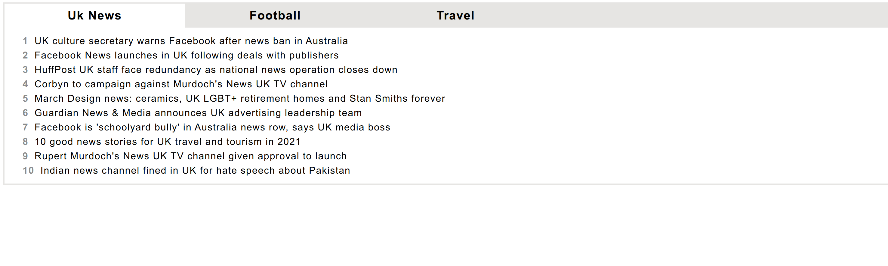

# Guardian clientside challenge

Based on Guardian challenge https://github.com/guardian/clientside-tabs-challenge.
With focus on Test Coverage and Reusability.

In order to run ".env" containing Guardian api key needs to be created. You can see ".example.env" for example.

Due to the task simplicity and the fact the simplicity I will use just react and store the
values in state - rather than using a state container like redux. I have not used any api library such as axios or sagas.

##Reusability
There is a "useGuardianApiHook", it would make sense to have an "apiFetchHook", which could then be generally used when 
fetching from api, though not necessary for this task.

##Test Coverage
There is a TabbedViewTest to show how I would approach testing. Due to limited time I have not done other tests. As the next test I 
would have done the fetch hook test.

Result UI:

## Available Scripts

In the project directory, you can run:

### `yarn start`

Runs the app in the development mode.\
Open [http://localhost:3000](http://localhost:3000) to view it in the browser.

The page will reload if you make edits.\
You will also see any lint errors in the console.

### `yarn test`

Launches the test runner in the interactive watch mode.\
See the section about [running tests](https://facebook.github.io/create-react-app/docs/running-tests) for more information.

### `yarn build`

Builds the app for production to the `build` folder.\
It correctly bundles React in production mode and optimizes the build for the best performance.

The build is minified and the filenames include the hashes.\
Your app is ready to be deployed!

See the section about [deployment](https://facebook.github.io/create-react-app/docs/deployment) for more information.

### `yarn eject`

**Note: this is a one-way operation. Once you `eject`, you can’t go back!**

If you aren’t satisfied with the build tool and configuration choices, you can `eject` at any time. This command will remove the single build dependency from your project.

Instead, it will copy all the configuration files and the transitive dependencies (webpack, Babel, ESLint, etc) right into your project so you have full control over them. All of the commands except `eject` will still work, but they will point to the copied scripts so you can tweak them. At this point you’re on your own.

You don’t have to ever use `eject`. The curated feature set is suitable for small and middle deployments, and you shouldn’t feel obligated to use this feature. However we understand that this tool wouldn’t be useful if you couldn’t customize it when you are ready for it.

## Learn More

You can learn more in the [Create React App documentation](https://facebook.github.io/create-react-app/docs/getting-started).

To learn React, check out the [React documentation](https://reactjs.org/).
